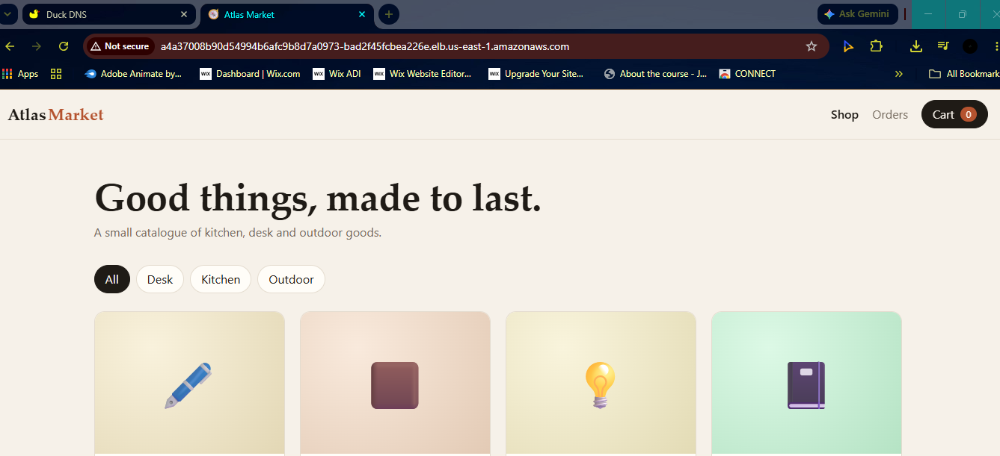
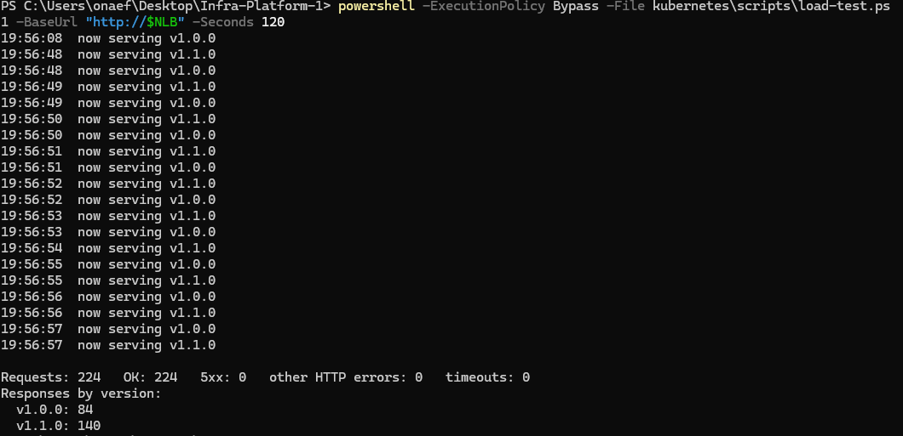

# Atlas Market: E-commerce Platform on AWS

**VPS deployment:** ran at https://atlasmarket.duckdns.org with a Let's Encrypt certificate. Torn down after review to avoid cost. Screenshots are in [Testing evidence](#testing-evidence).

Atlas Market is a simple e-commerce web application where you can browse products, check stock and place orders. It consists of 4 microservices working together, backed by Postgres and Redis.

The project shows how the application runs on AWS: Terraform manages the infrastructure across three environments (dev, staging and production), the containers are hardened and built through continuous integration, Kubernetes on EKS handles orchestration with Helm managing the manifests, and a single-server deployment on a VPS serves the app on a real domain with TLS.

EKS is used so that AWS manages the control plane and I can focus on the nodes and the workloads. The VPS shows the simplest production setup: one server, Docker Compose, nginx and a free **Let's Encrypt** certificate.

## Contents

1. [Architecture](#architecture)
2. [Repository structure](#repository-structure)
3. [Prerequisites](#prerequisites)
4. [Deploy to EKS](#deploy-to-eks)
5. [Deploy to a VPS (nginx + Let's Encrypt)](#deploy-to-a-vps-nginx--lets-encrypt)
6. [Run locally with Docker Compose](#run-locally-with-docker-compose)
7. [CI/CD](#cicd)
8. [Design decisions](#design-decisions)
9. [Considered and rejected](#considered-and-rejected)
10. [Testing evidence](#testing-evidence)
11. [Troubleshooting log](#troubleshooting-log)
12. [Cleanup](#cleanup)
13. [Cost notes](#cost-notes)
14. [Known limitations and future work](#known-limitations-and-future-work)

---

## Architecture

```
                                           Browser
                                              |
                        +---------------------+-------------------------+
                        |                                               |
                        | EKS (test sessions)                           | VPS (live)
+-----------------------v----------------------+   +--------------------v-------------------+
| AWS VPC 10.2.0.0/16 (prod), 2 AZs            |   | AWS VPC 10.3.0.0/16, 1 public subnet   |
|                                              |   |                                        |
| Public subnets /24                           |   | atlasmarket.duckdns.org (A record)     |
| +----------------------------------------+   |   |               |                        |
| | NLB      NAT GW (AZ a)  NAT GW (AZ b)  |   |   | Elastic IP + security group            |
| +--+----------------^-------------^------+   |   | (22 from my IP, 80, 443 open)          |
|    |                | image pulls |          |   |               |                        |
| Private subnets /20 |             |          |   | EC2 t3.small, Ubuntu 24.04             |
| +--v----------------+-------------+------+   |   | +----------------------------------+   |
| | EKS 1.34, 2 x t3.medium nodes          |   |   | | host nginx, TLS (Let's Encrypt)  |   |
| |                                        |   |   | +-------------+--------------------+   |
| |  ingress-nginx                         |   |   |               | 127.0.0.1:8080         |
| |      |                                 |   |   | +-------------v--------------------+   |
| |      v                                 |   |   | | Docker Compose, same 6 services  |   |
| |  frontend --> gateway ----> redis      |   |   | | and same images as EKS           |   |
| |                |    |         ^        |   |   | +----------------------------------+   |
| |                v    v         |        |   |   |                                        |
| |            order --> product -+        |   |   |                                        |
| |                \      /                |   |   |                                        |
| |                 v    v                 |   |   |                                        |
| |  postgres (StatefulSet, EBS gp3 5Gi)   |   |   |                                        |
| +----------------------------------------+   |   |                                        |
+----------------------------------------------+   +----------------------------------------+

CI/CD:  git push --> GitHub Actions (build, size < 150MB, non-root, Trivy)
                 --> Docker Hub atlas201/shop-* (vX.Y.Z, sha-*, latest)
                 --> pulled by the EKS nodes and by the VPS
```

**Services**

| Service         | Role                                                                           | Talks to              |
| --------------- | ------------------------------------------------------------------------------ | --------------------- |
| frontend        | nginx serving the shop UI, proxies `/api` to the gateway                       | gateway               |
| gateway         | Single API entry, routes to product and order, rate limits per client in Redis | product, order, redis |
| product-service | Catalogue and stock, owns stock changes, caches reads in Redis                 | postgres, redis       |
| order-service   | Creates and lists orders, reserves stock through product-service               | postgres, product     |
| postgres 16     | Product and order tables                                                       |                       |
| redis 7         | Cache and rate-limit counters, no persistence (disposable)                     |                       |

Every service exposes `/healthz` (process alive) and `/readyz` (dependencies reachable), and returns its `version` so rollouts can be observed from outside.

---

## Repository structure

```
.github/workflows/docker-publish.yml   CI: build, size check, non-root check, Trivy, push
ecommerce-application/services/<svc>/  App code, Dockerfile, .dockerignore
docker/                                docker-compose.yml (base), .override.yml (dev), .prod.yml, .env.example
terraform/
  bootstrap/                           S3 state bucket (local state)
  modules/{network,cluster,monitoring}/
  envs/{dev,staging,prod}/             EKS environments
  envs/vps/                            Single EC2 & Elastic IP for the VPS deployment
  envs/backend.hcl.example             Bucket name template (real backend.hcl is not commited)
kubernetes/
  namespace, storage, config, data, app, ingress, scaling, pdb, network-policies/   Plain manifests
  helm/atlas-market/                   Helm chart
  helm/ingress-nginx-values.yaml
  scripts/load-test.ps1                Zero-downtime test
vps/nginx/atlas-market.conf            Host nginx site for the VPS
images/                                Evidence screenshots
```

---

## Prerequisites

- AWS account and AWS CLI v2 configured (`aws sts get-caller-identity` works)
- Terraform >= 1.10 (native S3 state locking)
- kubectl, Helm (tested with Helm 4)
- Docker Desktop (local runs)
- An SSH key (`ssh-keygen -t ed25519`) for the VPS

---

## Deploy to EKS

**1. State bucket (done once)**

```powershell
cd terraform\bootstrap
terraform init ; terraform apply
# copy terraform\envs\backend.hcl.example to backend.hcl and set the bucket name from the output
```

**2. Cluster**

```powershell
cd terraform\envs\prod
terraform init -backend-config="..\backend.hcl"
terraform apply
aws eks update-kubeconfig --region us-east-1 --name atlas-prod
kubectl get nodes
```

**3. Ingress controller**

```powershell
helm install ingress-nginx ingress-nginx/ingress-nginx -n ingress-nginx --create-namespace -f kubernetes\helm\ingress-nginx-values.yaml
$NLB = kubectl -n ingress-nginx get svc ingress-nginx-controller -o jsonpath="{.status.loadBalancer.ingress[0].hostname}"
```

**4. Application**

```powershell
kubectl apply -f kubernetes\namespace\namespace.yaml
kubectl -n atlas-market create secret generic atlas-db --from-literal=password='<password>'
helm install atlas kubernetes\helm\atlas-market -n atlas-market --set image.tag=v1.0.0
kubectl -n atlas-market get pods -w
```

Open `http://$NLB`.

**Day-2 operations**

```powershell
# Rolling update
helm upgrade atlas kubernetes\helm\atlas-market -n atlas-market --reuse-values --set image.tag=v1.1.0
# Roll back
helm rollback atlas <revision> -n atlas-market
# Turn on network policies
helm upgrade atlas kubernetes\helm\atlas-market -n atlas-market --reuse-values --set networkPolicies.enabled=true
```

---

## Deploy to a VPS (nginx + Let's Encrypt)

Same images, same Compose stack, one server. Terraform in `terraform/envs/vps` creates a small VPC with one public subnet, a security group (SSH from the operator's IP only, 80 and 443 open), an Ubuntu 24.04 t3.small with an encrypted disk and IMDSv2, and an **Elastic IP** so DNS survives a stop/start. First-boot `user_data` installs Docker, Compose, nginx, certbot and 2 GiB of swap.

**1. Server**

```powershell
cd terraform\envs\vps
terraform init -backend-config="..\backend.hcl"
terraform apply          # outputs public_ip and ssh_command
```

**2. DNS:** set the DuckDNS record `atlasmarket` to `public_ip` and check with `Resolve-DnsName atlasmarket.duckdns.org`.

**3. App** (on the server)

```bash
git clone https://github.com/Jason2303/ecommerce-eks-platform.git
cd ecommerce-eks-platform/docker
cp .env.example .env
sed -i -e "s/^TAG=.*/TAG=v1.1.0/" \
       -e "s/^FRONTEND_PORT=.*/FRONTEND_PORT=127.0.0.1:8080/" \
       -e "s/^POSTGRES_PASSWORD=.*/POSTGRES_PASSWORD=$(openssl rand -hex 16)/" .env
chmod 600 .env
docker compose -f docker-compose.yml -f docker-compose.prod.yml up -d
```

`FRONTEND_PORT=127.0.0.1:8080` publishes the frontend on loopback only, so nginx is the only way in. The two `-f` flags apply the production hardening and skip the dev override file.

**4. Reverse proxy and HTTPS**

```bash
sudo cp ~/ecommerce-eks-platform/vps/nginx/atlas-market.conf /etc/nginx/sites-available/atlas-market
sudo ln -sf /etc/nginx/sites-available/atlas-market /etc/nginx/sites-enabled/atlas-market
sudo rm -f /etc/nginx/sites-enabled/default
sudo nginx -t && sudo systemctl reload nginx
sudo certbot --nginx -d atlasmarket.duckdns.org --redirect --agree-tos --no-eff-email -m <email>
sudo certbot renew --dry-run
```

certbot proves control of the domain with the HTTP-01 challenge (Let's Encrypt fetches a token over port 80 through public DNS), installs the certificate into the nginx site, adds the HTTP to HTTPS redirect, and renews automatically through a systemd timer. TLS ends at nginx. The hop from nginx to the container is plain HTTP on loopback inside the same host.

**Request path:** browser, DuckDNS, Elastic IP, security group (443), host nginx (TLS), `127.0.0.1:8080` frontend container, gateway, services.

**Why the domain points to the VPS and not EKS:** DuckDNS only supports A records (name to IP). The EKS entry point is an NLB hostname whose IPs live and die with the NLB, and the cluster is torn down after testing. The Elastic IP is static. On EKS with a real domain, the production setup is a Route 53 alias record to the NLB (automated by ExternalDNS) with certificates from cert-manager or ACM.

---

## Run locally with Docker Compose

```powershell
cd docker
copy .env.example .env      # change POSTGRES_PASSWORD
docker compose up -d        # base + override (dev): debug ports, TAG=dev
```

Production-like run:

```powershell
$env:TAG="v1.1.0"
docker compose -f docker-compose.yml -f docker-compose.prod.yml up -d
```

| File                          | Purpose                                                                                                                                         |
| ----------------------------- | ----------------------------------------------------------------------------------------------------------------------------------------------- |
| `docker-compose.yml`          | Services, 4 networks (3 internal), healthchecks, resource limits                                                                                |
| `docker-compose.override.yml` | Auto-loaded in dev: extra ports, debug port 3300                                                                                                |
| `docker-compose.prod.yml`     | Hardening: `restart: always`, `no-new-privileges`, `cap_drop: ALL`, read-only root + tmpfs, log rotation, `pull_policy: always`, `TAG` required |

---

## CI/CD

`.github/workflows/docker-publish.yml` builds the four images in a matrix and blocks the push if any gate fails:

1. **Build** (multi-stage, alpine runtime)
2. **Size gate:** image under 150 MB
3. **Non-root gate:** image user is a numeric non-zero UID
4. **Trivy** vulnerability scan
5. **Push** to Docker Hub `atlas201/shop-<service>`

Tags: `vX.Y.Z` (immutable release, used for every deployment), `sha-<commit>` (traceability), `latest` (convenience only, never deployed).

---

## Design decisions

**Terraform**

- Folders per environment were chosen over workspaces because the environment (`envs/prod`) is explicit in the path, meaning fewer mistakes and no hidden state to remember. Each environment has its own backend config and tfvars and can differ, so one environment can have more resources than another. Each environment can also point to its own account and bucket without restructuring the Terraform code (very useful in multi-account OU setups).
- State in S3 with native locking (`use_lockfile`). Partial backend configuration keeps the account ID in `backend.hcl`, which is not committed.
- Thin wrappers around the community VPC/EKS modules: tested open-source modules instead of writing every resource from scratch, with my defaults set once in the wrapper.
- Public subnets are /24 (256 IPs). Private subnets are /20 (4,096 IPs) to avoid running out, because every Pod takes a VPC IP. One NAT gateway per Availability Zone in `staging` & `prod`, one in `dev` to save cost.
- Pod Identity gives the EBS CSI driver and CloudWatch agent their AWS permissions through their own service accounts, instead of over-privileged nodes.
- `default_tags` only applies to resources Terraform creates directly. The EC2 instances are launched by the Auto Scaling Group and the Postgres EBS volume is created by the EBS CSI driver at runtime, so they get their own tags through `launch_template_tags` and `extraVolumeTags`.
- The VPS is module-free, has an Elastic IP so the address never changes, and uses `ignore_changes` on the AMI so a new Ubuntu image never replaces the server.

**Containers**

- Multi-stage builds on alpine keep images under 150 MB with only production dependencies.
- Images run as a numeric non-root UID, because the kubelet can only verify `runAsNonRoot` when the user is a number (e.g 1001)
- Exec-form `CMD` makes node PID 1, so it receives SIGTERM and finishes in-flight requests during a rollout.
- Deployments always use an immutable version tag (`v1.0.0`), never `latest`.

**Kubernetes**

- Postgres runs as a StatefulSet on a gp3 volume with `WaitForFirstConsumer` not `Immediate`, because an EBS volume is locked to one AZ and must be created where the Pod lands.
- Redis has no disk (persistent storage). Everything within it can be rebuilt.
- Readiness checks dependencies and takes a Pod out of the Service, liveness only checks the process and restarts it. Liveness never checks Postgres.
- Rolling update `maxSurge 1 / maxUnavailable 0` keeps full capacity during a release; PDB `minAvailable 1` protects against node drains and upgrades during voluntary downtime.
- HPA scales gateway and product-service from 2 to 5 at 70% of the CPU request.
- Default-deny NetworkPolicies with explicit allows for DNS and each service's real callers.
- Pod Security `restricted` on the namespace. Helm chart and plain manifests are kept identical.

**VPS**

- nginx over Apache because the frontend already uses nginx. certbot `--nginx` handles the certificate, redirect and renewal.
- The frontend is published on `127.0.0.1` only, so nginx is the only way in.

---

## Considered and rejected

- **Tiered subnets per app tier:** On other AWS projects, I implemented a tier system to separate services for security purposes (only services that need to talk to each other talk to each other). On EKS, Pods share the node subnets. NetworkPolicies do the isolation instead.
- **AWS API Gateway:** The in-cluster gateway already routes and rate limits; it would add cost and latency.
- **RDS and ElastiCache:** Best choice for production due to multi-AZ failovers as well as backups for the DB, but out of budget for this project.
- **Postgres replica:** Cost optimization. A single instance with EBS persistence is implemented instead.
- **Self-signed TLS on EKS:** No domain for the NLB, so real HTTPS is shown on the VPS instead.
- **AWS Load Balancer Controller:** Production choice (ingress-nginx is being retired). ingress-nginx was kept for portability.

---

## Testing evidence



**Zero-downtime rolling update v1.0.0 to v1.1.0:** 224 requests during the rollout, 224 OK, 0 5xx, 0 timeouts, both versions served while Pods were replaced.



| Area       | What it shows                                                          | Evidence                                                                                                                                                             |
| ---------- | ---------------------------------------------------------------------- | -------------------------------------------------------------------------------------------------------------------------------------------------------------------- |
| Terraform  | Plan before apply, apply, plan after apply (no drift)                  | [plan before](images/terraform-images/dev-plan-before.png), [apply](images/terraform-images/dev-apply.png), [plan after](images/terraform-images/dev-plan-after.png) |
| Terraform  | Staging and prod plans                                                 | [staging](images/terraform-images/staging-plan.png), [prod](images/terraform-images/prod-plan.png)                                                                   |
| Docker     | Stack healthy, image sizes, non-root UID                               | [compose](images/docker-images/docker-started-imagesize-uid.png)                                                                                                     |
| Docker     | Release tags on Docker Hub                                             | [tags](images/docker-images/docker-tags.png)                                                                                                                         |
| Docker     | Shop and orders working locally                                        | [shop](images/docker-images/shop-page.png), [orders](images/docker-images/orders-page.png)                                                                           |
| Kubernetes | 2 nodes in 2 AZs, 7 add-ons, system Pods running                       | [cluster](images/k8s-images/k8s-1.png), [nodes](images/k8s-images/get-pods-and-nodes.png)                                                                            |
| Kubernetes | 10 Pods running, replicas spread across both nodes, HPAs               | [app](images/k8s-images/k8s-app-running.png), [pods](images/k8s-images/pods-running.png)                                                                             |
| Kubernetes | Ingress behind the NLB, API answering                                  | [ingress](images/k8s-images/ingress-nlb.png), [app via NLB](images/k8s-images/app-nlb.png)                                                                           |
| Kubernetes | Pod Security restricted rejects a non-compliant Pod                    | [pod security](images/k8s-images/pod-security.png)                                                                                                                   |
| Kubernetes | Requests, limits, startup/readiness/liveness probes                    | [limits and probes](images/k8s-images/limits-probe.png)                                                                                                              |
| Kubernetes | Order survives deleting the Postgres Pod (PVC on gp3)                  | [persistence](images/k8s-images/persistence.png), [PVC](images/k8s-images/postgres-pvc.png), [orders](images/k8s-images/orders-page.png)                             |
| Kubernetes | Rolling update with helm upgrade, rollback, history                    | [helm side](images/k8s-images/rollout-window2.png)                                                                                                                   |
| Kubernetes | HPA, PDBs, 8 NetworkPolicies (allowed call ok, blocked call times out) | [scaling and safety](images/k8s-images/scaling-safety.png)                                                                                                           |
| Kubernetes | Everything destroyed (81 of 81)                                        | [cleanup](images/k8s-images/cleanup.png)                                                                                                                             |
| VPS | HTTPS with a valid Let's Encrypt certificate | [browser](images/vps-images/vps-secure-connection.png) |
| VPS | 6 containers healthy, certificate, http to https redirect (301), renewal dry run | [server](images/vps-images/server.png) |
| VPS | Torn down (9 of 9 destroyed) | `terraform destroy` in `terraform/envs/vps` |

---

## Troubleshooting log

| Problem                                               | Cause                                                                                                                                  | Fix                                                                                          |
| ----------------------------------------------------- | -------------------------------------------------------------------------------------------------------------------------------------- | -------------------------------------------------------------------------------------------- |
| Compose frontend "unhealthy"                          | `localhost` resolved to IPv6, nginx listens on IPv4 only                                                                               | Healthcheck uses `127.0.0.1`                                                                 |
| Port 3000 "already in use"                            | A VPN service on the laptop holds port 3000                                                                                            | Gateway debug port moved to 3300 (`GATEWAY_DEBUG_PORT`)                                      |
| CI green but nothing on Docker Hub                    | Push step truncated when editing the workflow                                                                                          | Completed the push step                                                                      |
| Account ID visible in `backend.tf`                    | Bucket name contains the account ID                                                                                                    | Partial backend config: `backend.hcl` gitignored, passed with `-backend-config`              |
| `helm` not recognized after install                   | Terminal kept the old PATH                                                                                                             | Reload PATH in the session                                                                   |
| `helm install --wait` "context canceled"              | VPN dropped the long-lived connection                                                                                                  | Install without `--wait`, watch with `kubectl get pods -w`                                   |
| **0 Pods created on EKS**                             | CloudWatch add-on (Application Signals) injected a Java init container into every Pod, which violates Pod Security `restricted`        | `monitorAllServices = false` in the add-on configuration (Terraform), then `rollout restart` |
| Load test showed v1.0.0 and v1.1.0 alternating        | Expected during a rollout: old and new Pods both serve until the old ones drain                                                        | Documented, this is the zero-downtime proof                                                  |
| VPS `terraform validate` failed on the security group | AWS rejects apostrophes in security group rule descriptions                                                                            | Removed the apostrophe                                                                       |
| Unexpected Security Hub charges                       | Security Hub was enabled per region (13 regions) with the account as delegated admin; disabling it in one region left the rest running | Removed the admin role and disabled it in every region with the CLI                          |

---

## Cleanup

**EKS (order matters, so Terraform does not get stuck on resources Kubernetes created):**

```powershell
helm uninstall atlas -n atlas-market
kubectl delete namespace atlas-market
helm uninstall ingress-nginx -n ingress-nginx
kubectl delete namespace ingress-nginx
kubectl get pv                                 # "No resources found" output
cd terraform\envs\prod ; terraform destroy
```

**VPS:**

```powershell
cd terraform\envs\vps ; terraform destroy
```

**State bucket last**, once nothing else uses it: `cd terraform\bootstrap ; terraform destroy`.

---

## Cost notes

| Setup    | Approx. cost   | Main items                                                 |
| -------- | -------------- | ---------------------------------------------------------- |
| EKS prod | about $0.35/hr | Control plane $0.10/hr, 2 x t3.medium, 2 NAT gateways, NLB |
| VPS      | about $0.03/hr | t3.small, Elastic IP, 20 GB gp3                            |

EKS was brought up only for testing sessions and destroyed the same day. The NAT gateways are the biggest fixed cost, which is why dev uses one and staging/prod use one per AZ.

The VPS ran for about 13 hours for review then was destroyed.

---

## Known limitations and future work

- **Single Postgres instance.** Data survives Pod restarts (EBS), but not an AZ failure. Production: RDS Multi-AZ will be utilized.
- **No authentication.** The gateway is where it would be implemented.
- **VPS is a single point of failure** and Compose updates cause a brief restart. That is the trade-off against EKS.
- **No TLS on EKS.** With a real domain: ExternalDNS + Route 53 alias + cert-manager.
- **ingress-nginx is being retired** upstream. Production alternative: AWS Load Balancer Controller or Gateway API.
- Planned: preferred pod anti-affinity, Helm values files per environment, database migrations as an init container.
